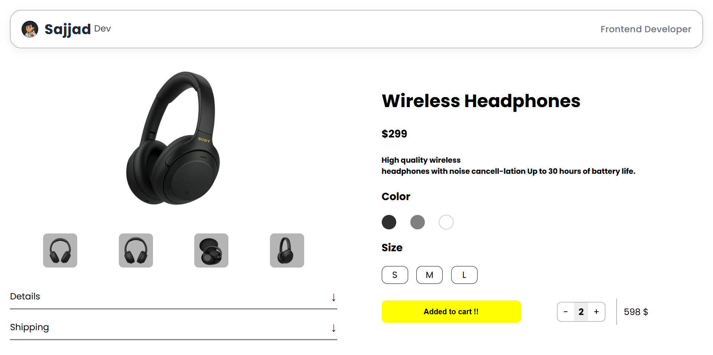

# Modern Product Page

A clean and minimal Product Page built with pure HTML & CSS,  
focused on design, responsiveness, and smooth user interactions — without using JavaScript yet.

---

## 🚀 Features

- ⚡ Fully responsive layout (Flexbox + modern CSS units)
- 🎨 Interactive color and size selectors (CSS-only using :checked)
- 📂 Product details section (currently static, smooth transition coming in the next update) (Updaating)
- 🖼️ Clean product gallery design (no JS yet)
- 🌗 minimalist theme

---

## 🧩 Technologies Used

- HTML5 semantic structure
- CSS3 (Flexbox, transitions, pseudo-elements, attribute selectors)
- _(JavaScript not used yet — see below 👇)_

---

## 🧠 Developer Note

JavaScript hasn’t been added yet because I’m still learning JS.  
Once I master it, all my projects — including this one — will become fully interactive 💪  
For now, the details section doesn’t open smoothly — I’ll fix it in the next update once I understand transitions better.

---

## 📸 Preview

---

## 🧠 Key Concepts Practiced

- Custom inputs with :checked (for colors & sizes)
- Creating animations with max-height and opacity (to be improved soon)
- Using ::before / ::after for icons and effects
- Building modern UI without frameworks

---

## 🔧 How to Run

1. Clone this repository:
   `bash
   git clone https://github.com/SajjadR17/modern-product-page.git

---

## 🧾 License

This project is licensed under the MIT License — meaning you're free to use, modify, and share it,  
as long as you give proper credit to Sajjad Roohandeh.
